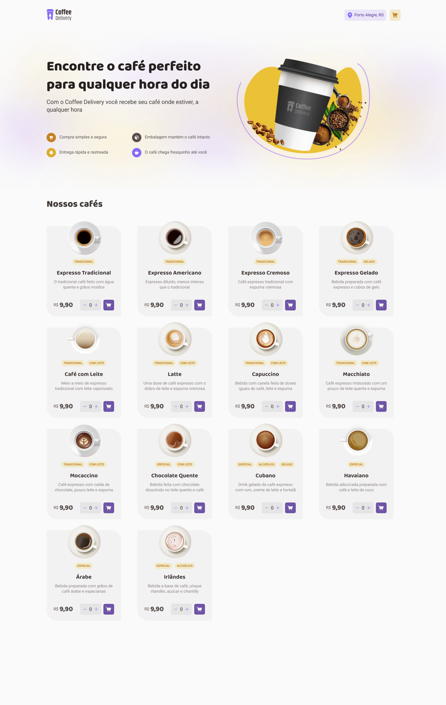

  <a href="#-tecnologias">Tecnologias</a>&nbsp;&nbsp;&nbsp;|&nbsp;&nbsp;&nbsp;
  <a href="#-projeto">Projeto</a>&nbsp;&nbsp;&nbsp;|&nbsp;&nbsp;&nbsp;
  <a href="#-como-rodar">Como rodar</a>&nbsp;&nbsp;&nbsp;|&nbsp;&nbsp;&nbsp;
  <a href="#-como-contribuir">Como contribuir</a>&nbsp;&nbsp;&nbsp;
  

 

  

# Coffee Delivery

## 🚀 Tecnologias

Esse projeto foi desenvolvido com as seguintes tecnologias:

- [Npm](https://www.npmjs.com/) - 8.19.2
- [Vite](https://vitejs.dev/) - ^4.2.0
- [TypeScript](https://www.typescriptlang.org/) - ^4.9.3
- [React](https://react.dev/) - ^18.2.0
- [React Hook Form](https://react-hook-form.com/) - ^7.43.9
- [React Router Dom](https://reactrouter.com/en/main) - ^6.9.0
- [Zod](https://zod.dev/) - ^3.21.4
- [Styled Components](https://styled-components.com/) - ^5.3.9
- [Phosphor Icons](https://phosphoricons.com/)

## 💻 Projeto

Projeto de Front-end de React de uma cafeteria.

- Módulo ReactJS do Ignite na plataforma da [Rocketseat](https://www.rocketseat.com.br/).

## 🚀 Como Rodar

- Clone o projeto.
- Entre na pasta do projeto e rode 'npm install' (use 'yarn install' se for essa a sua configuração).
- npm run dev (para rodar o projeto na porta indicada).

## 🤔 Como contribuir

- Faça um fork desse repositório;
- Cria uma branch com a sua feature: `git checkout -b minha-feature`;
- Faça commit das suas alterações: `git commit -m 'feat: Minha nova feature'`;
- Faça push para a sua branch: `git push origin minha-feature`.

Depois que o merge da sua pull request for feito, você pode deletar a sua branch.

## 📝 Licença

Esse projeto está sob a licença MIT.
